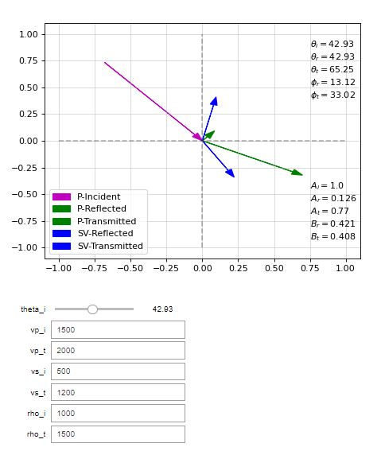

# Zoeppritz Equation

Implementation of the theoretical formulations of reflection and transmission of plane waves described in SEISMIC WAVE THEORY by Edward S. Krebbes.

The Zoeppritz equations describe the energy splitting of a seismic wave at an interface, using plane wave assumptions. They describe the amplitudes of compressional and shear waves at boudaries and are able to incorporate mode conversions.

Here I present a simple widget that takes an incident angle, along with medium properties -- compressional and shear wave speed, and density -- of both incident and transmitted media to understand the energy splitting at an simple horizontal interface.

Note that Zoeppritz equations are not adapt to describe transmission and reflection of plane waves at critical and supercritical angles.

